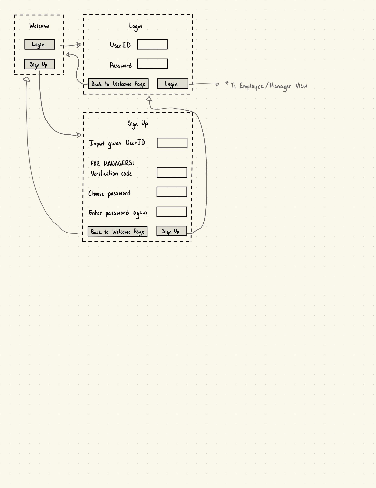
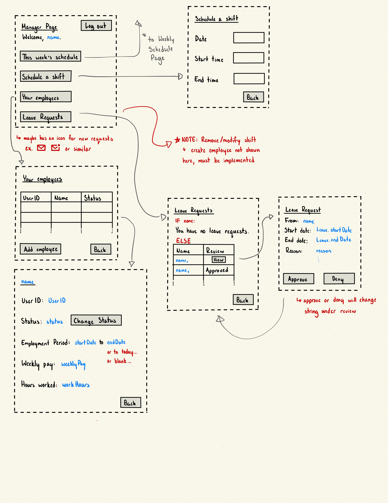
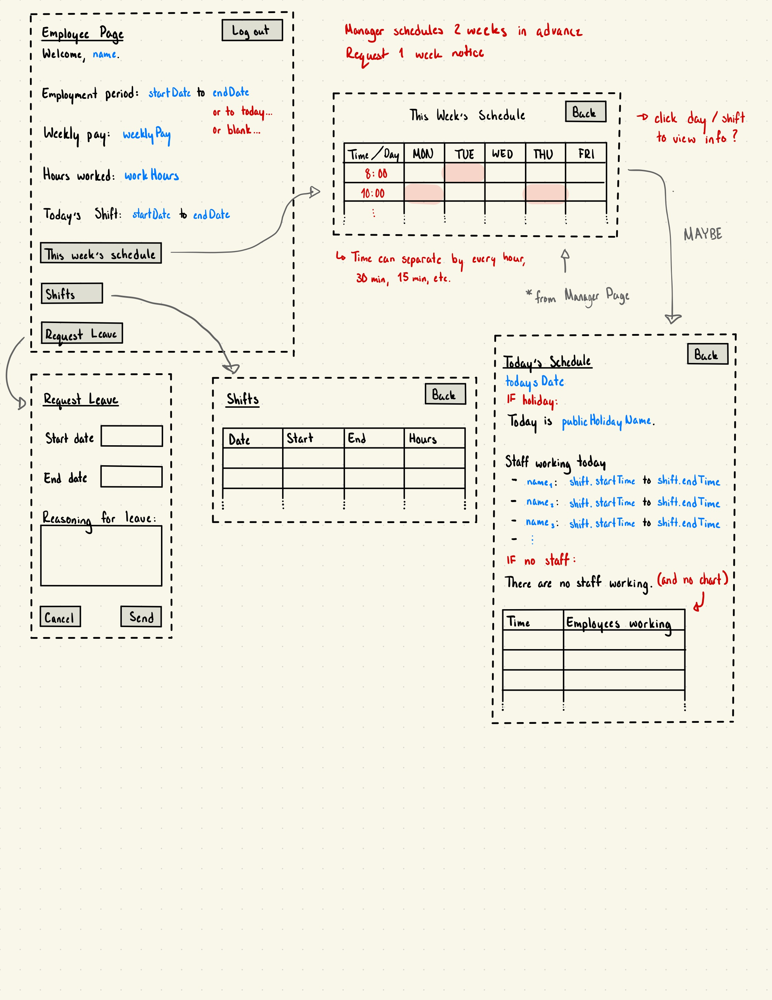

# Human Resources System
## Developers
* Hinar Alsharkawy: `hinobino`
* Jake Cohen: `jake-e-cohen`
* Emmett Russell: `eruss341`
* Michelle Zaporozhets: `mzaporoz`
* Andy Kaiyuan Shi: `Andy232306`

## Intent

Our team has had a lot of experience in dysfunctional work environments. Confusion over scheduling, payroll,
and time off can contribute to a poor work environment and unhealthy relationships between managers and employees.
Our software seeks to streamline the employee and management experience by providing <em>clean</em> and 
<em>effective</em> methods for managing scheduling and payroll. 🙂‍↕️🙂‍↕️

Are you interested in software that allows you to create and schedule employees with ease? Are you looking for software
that lets you export your assigned shifts to iCalendar? If so, our software might be for you! Let us at 
<strong>Jam, Eh Inc.</strong> take the stress of HR management off of your hands, so you can focus on what 
<em>really</em> matters: cultivating a fun and stress-free work environment! 🤩🤩🤩

## Table of Contents
1. [Features of the Software](#features)
2. [Installation Instructions](#installation-instructions)
   * Required packages
   * API Setup
3. [Usage Guide](#usage-guide)
4. [License](#license)
5. [Feedback](#feedback)
6. [Contributing](#contributing)

## Features
The features of this software are subdivided into two parts: features for managers and features for employees.

### Managers
* Managers may create accounts and log in.
* Once logged in, they have access to the following:
  * Creating employee accounts: this entails creating an inactive employee ID, which employees may then themselves 
  activate.
  * Managers may schedule shifts for employees whom they created.
    * Shifts may not be scheduled during public holidays, must be scheduled between 9:00-17:00, and may not be scheduled
    if during a time where an employee has had a time off request accepted.
  * Managers may delete shifts they had previously assigned.
  * Managers may accept/deny time off requests submitted by employees.
    * If a time off request is approved during a day where an employee was previously scheduled to work, the shift is 
    automatically removed.
  * Managers may view a list of all of their employees
    * In this view, managers may further select individual employees and view more information about their employment
    period, pay rate, and hours worked. In this view, managers may fire employees or change their pay rate.
  * Managers may view a master schedule for the current week to see where gaps in the schedule exist.

### Employees
* Employees may activate accounts created by a manager. They may only sign up with IDs that have been created by
managers, they may not create their own accounts independently. Once the account is activated, they may log in.
* Once logged in, they have access to the following:
  * Employees may submit a time off request as long as the request is submitted at least 7 days in advance.
  * Employees may view a weekly schedule view.
  * Employees can view the number of hours they have worked and their current pay rate.
  * Employees can export their weekly schedule to a `.ics` file, which they may then add to their own personal digital
  calendar.

Please see below for some rough sketches detailing the basic structure of this software, drawn by `mzaporoz`!

## Installation Instructions
### Dependencies
In addition to running the latest version of Java, please ensure the following packages are installed:
* `org.json` - Ver. 20230618
* `com.squareup.okhttp3` - Ver. 4.10.0
  * Please see [this](https://square.github.io/okhttp/) page for more information about this package.

For more information on dependencies, please see `pom.xml`. If using an IDE like IntelliJ to run the software, you
should be able to have the IDE automatically install all required packages from this configuration file.

### API Configuration
This program uses AbstractAPI to get access to the latest public holiday data!

#### AbstractAPI Configuration:
1. Visit AbstractAPI at [this](https://www.abstractapi.com/api/holidays-api) page.
2. Click the `START FOR FREE` button and create an account.
3. You should then be given a free account to make 1000 requests per month. You will also be given an associated API 
key.
4. For your reference, we recommend you create a new `key.txt` file in the root directory of the repository. Paste your
API key in here.
5. You must configure a local environment variable that keeps track of your API key.
   1. To do this, open your IDE and click the `Run` menu option in the toolbar.
   2. From there, go to `Edit Configurations...`.
   3. Click the `+` button in the top-left corner of the pop-up window. Click the `Application` option.
   4. Pick whatever name you want.
   5. Under `Build and run`, ensure you list `app.Main` as the file to run.
   6. Under `Environment Variables`, type `key=<your API key>`, replacing `<your API key>` with the API key you have
   stored in `key.txt`. DO NOT INCLUDE ANY EXTRA CHARACTERS ANYWHERE IN THIS FIELD.

### General Set-Up
Once all of the above have been taken care of, simply download the repository by clicking the green `<> Code` button and
downloading the `.zip` file listed. Once unzipped, you can run this program through the `src/main/java/app/Main` file.
If using an IDE, ensure you mark `src/java` as the sources root.

## Usage Guide
Once the software is downloaded, it may be run by running the `Main` script in `src/main/java/app/Main`. This may be
done on the command line or within an IDE like IntelliJ. As previously mentioned in the 
[installation instructions](#installation-instructions), if using an IDE, ensure the `src/java` folder is marked as the 
sources root. This can be done by right-clicking on the folder and clicking `Mark Directory As > Sources Root` in the 
pop-up menu.

Please consult the [feedback](#feedback) section if you have any issues running the application.

## License
This software is listed with an **MIT License**. Please consult `LICENSE` for more information about what usage and
modification of this software is permitted, as well as any associated restrictions.

## Feedback
Please see this [Typeform](https://3wpshcblqr3.typeform.com/to/EmIY1Fzp) to submit any feedback! Do note that while we 
appreciate constructive criticism, please be kind! Our developers have worked tirelessly to deliver you the software. 
Don't make them cry!

## Contributing
Once released, this software will likely _not_ be further developed. Any parties seeking to contribute to this
repository should be aware merge requests will not be reviewed or accepted by the authors of this software.

For those seeking to build upon the software, we recommend you fork or clone the repository and develop it 
independently. To do this, you may click the `Fork` button in the top-right corner of the repository's home page. To
make a clone, click the green `<> Code` button and either download the `.zip` file or use the provided URL to clone the
repository via the command line.

We apologize in advance for the lack of further development of this software! Please understand our team is hard at work
developing new and exciting projects! Stay tuned 🤩🤩